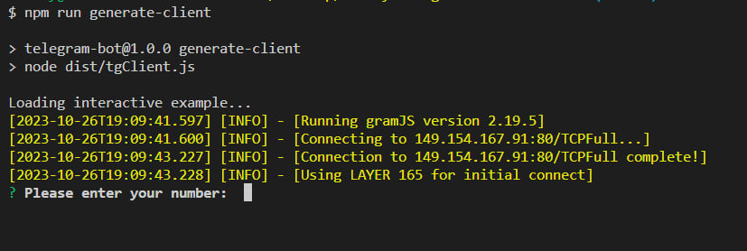
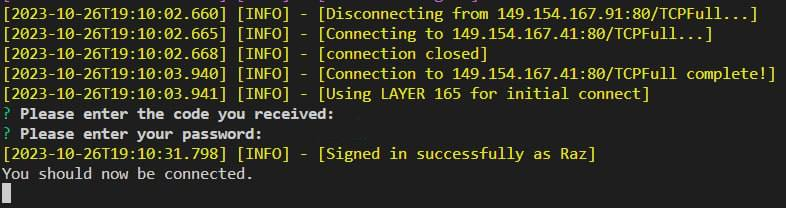
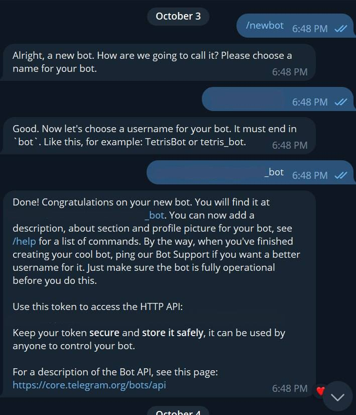
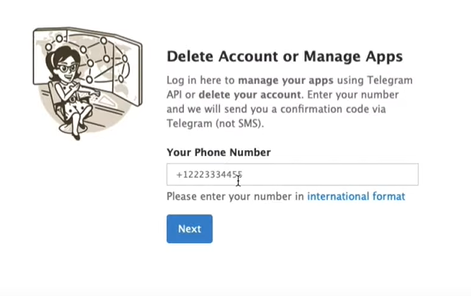
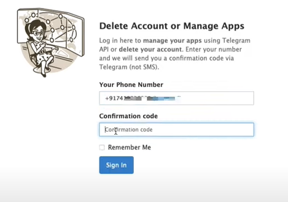
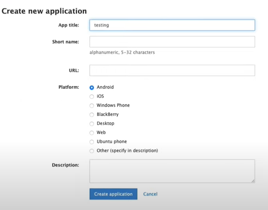
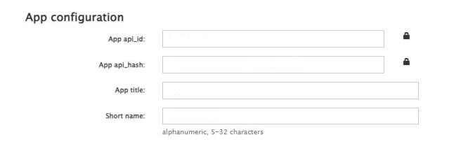

# Telegram-Bot

[Documentation](https://docs.google.com/document/d/1FRGJAZgalzReltY1i6lbb-eR7lqpXm95QTiYLmOFZVo)

### project-root/
### │
### ├── src/
### │ ├── bot.ts // Main bot initialization and setup
### │ ├── common/ // Directory for common files
### │ │ ├── enums // Directory for enums
### │ │ │ └── dates.ts // File with date enums
### │ │ │ 
### │ │ ├── helpers // Directory for helper functions
### │ │ │ │── checkTimeRange.helper.ts // Time range checker function
### │ │ │ │── DateRange.helper.ts // Class to work with dates
### │ │ │ │── GoogleUpdate.helper.ts // GoogleUpdate helper
### │ │ │ │── isReacted.helper.ts // Function to check message reactions
### │ │ │ │── messageВyDay.helper.ts // Function to create daily statistics message
### │ │ │ └── userStatsMessage.helper.ts // Function to create users statistics message
### │ │ │ 
### │ │ ├── types // Directory for types
### │ │ │ │── botTypes.ts // Bot types
### │ │ │ │── dailyMessageProps.ts // Daily statistics types
### │ │ │ │── envType.ts // Env variable types
### │ │ │ │── reactionTypes.ts // Daily messages reaction types
### │ │ │ └── userStatsTypes.ts // Users statsistics types
### │ │ │ 
### │ │ └── utils // Directory for utils
### │ │ │ │── constants.ts 
### │ │ │ │── database.ts 
### │ │ │ │── env.ts 
### │ │ │ └── messages.ts 
### │ │ │ 
### │ ├── models/ // Directory services and bot commands
### │ │ ├── commands // Directory for bot commands
### │ │ │ │── help.ts // Command help 
### │ │ │ │── start.ts  //Command start
### │ │ │ │── stats_date.ts // Command tp gett custom date statistics
### │ │ │ │── stats_life.ts // Command to get user's statistics
### │ │ │ │── stats_month_current.ts // Command to get current month statistics
### │ │ │ │── stats_month_last.ts // Command to get last month statistics
### │ │ │ │── stats_month.ts // Command to get custom month statistics
### │ │ │ │── stats_week_current.ts // Command to get current week statistics
### │ │ │ │── stats_week_last.ts // Command to get last week statistics
### │ │ │ │── stats_week.ts // Command to get custom week statistics
### │ │ │ │── stats_yesterday.ts // Command to get previous day statistics
### │ │ │ │── stats.ts // Command to get current day statistics
### │ │ │ └── stop.ts  // Command stop
### │ │ │ 
### │ │ │── service // Directory for services
### │ │ │  │── bot.service.ts // Bot class
### │ │ │  │── client.service.ts // Client class
### │ │ │  │── dailyReaction.service.ts // Daily statistics class
### │ │ │  │── Upload2Google.ts // Google upload class 
### │ │ │  └── usersStatistics.service.ts  // User statistics class 
### │ │ 
### │ 
### ├── node_modules/ // Node.js modules (created when you install dependencies)
### │
### ├── index.ts // Entry point to start your bot
### ├── tsconfig.json // TypeScript configuration file
### ├── package.json // Project dependencies and settings
### ├── tgClient.ts // Script which generates telegram client
### └── jest.config.js // Jest configuration file

# Statistics Bot Setup, Running, and Testing Guide

## Table of Contents

1. [Prerequisites](#prerequisites)
2. [Getting Started](#getting-started)
3. [Running the App](#running-the-app)
4. [Running Tests](#running-tests)

## Prerequisites

Before you begin, make sure you have the following software installed on your machine:

- [Node.js](https://nodejs.org/) (LTS version recommended)
- [npm](https://www.npmjs.com/)
- [Git](https://git-scm.com/downloads)

## Getting Started

### 1. Clone the Repository

```
git clone https://github.com/Solicy-App/Solicy-Telegram-Statistics-Bot.git
```

### 2. Install dependencies
`npm i`

### 3. Create session key.
#### Generate session key
```
npx tsc tgClient.ts
npm run generate-client
```

#### Enter in console your phone number

#### Copy the code sent by Telebram
#### Enter code in console
#### Enter your telegram password(optional)


#### Copy session key from Telegram saved messages

### 4. Add the key to your env file to get the Telegram client from code.

### 5. Create a Telegram bot. 

#### Send `/newbot` command to https://t.me/BotFather
#### Set bot username and nickname

### 6. Copy bot token and add to env file.

### 7. Create app in https://my.telegram.org/apps

#### Enter your phone number.


#### Copy the verification code sent by Telegram and enter it here.


#### Click on Api development tools.


#### Fill in all fields and select the platform - Desktop.



### 8. Open your app and copy API hash and API ID


### 9. Add API hash and API ID to env file

### 10. Add the created bot to your Telegram group.


## Running the App
`npm run dev`


## Commands

### `/start` - say hi to bot
### `/help` - if you need some help
### `/stats` - check today's statistics
### `/stats_yesterday` - check yesterday's statistics
### `/stats_date [[mm-dd-yyyy]]` - check statistics for a specified date
### `/stats_week [[mm-dd-yyyy]]` - check statistics for the specified week
### `/stats_week_current` - check statistics for the current week
### `/stats_week_last` - check statistics for the last week
### `/stats_month [[mm-dd-yyyy]]` - check statistics for a specified month
### `/stats_month_current` - check current month statistics
### `/stats_month_last` - check statistics for last month
### `/stats_life` - get statistics for all users


## Running Tests
`npm run test`